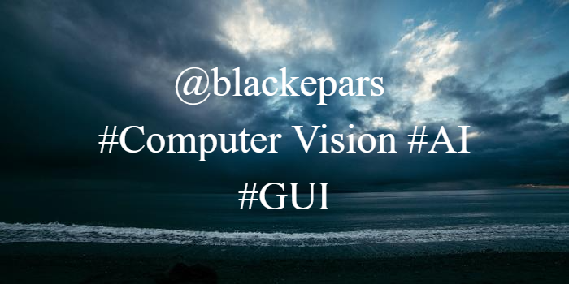

### I'm Ramazan GUL
#### R&D Engineer - Python Developer
- 🦾 I’m currently working on Optimak STU - R&D Center 

I'm Developing Computer Vision, Artificial Intelligence and Desktop GUI softwares.

## Skills: 
- 🐍 Python 
- 📷 OpenCV 
- 🤖 Tensorflow 
- 🖥️ PyQt 

      

  
