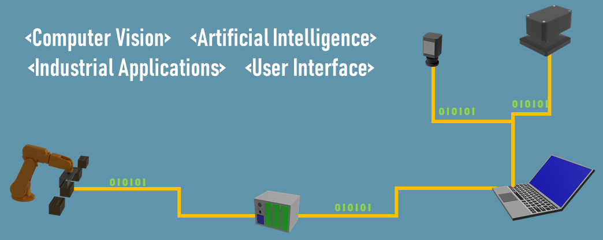

### I'm Ramazan GUL
#### R&D Software Development Engineer (Python, GUI, Computer Vision, Industrial Integration)
- 🦾 I’m currently working on Optimak STU - R&D Center 

I'm Desktop GUI softwares in PyQt, Computer Vision Applications in OpenCV and Tensorflow.
# 

## Skills: 
-  Python 
- 🖥️ PyQt 
-  OpenCV 
-  Tensorflow 

# 
### Contact With Me:
      

# 
 
